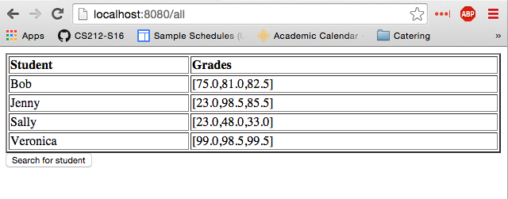

GradeServer
===========

For this homework, you will extend a program that uses [Jetty](https://eclipse.org/jetty/) and [Java Servlets](https://docs.oracle.com/cd/E17802_01/products/products/servlet/2.5/docs/servlet-2_5-mr2/index.html?javax/servlet/package-summary.html) to display student grades on a web page.

## Due Friday 4/15 - 11:59pm

## Starter Code

The starter code provided for you in this assignment implements a `GradeBook` data structure and basic server that allows the user to search for the grades of a specific student.

Before getting started on this assignment, it is strongly recommended you execute the starter code and thoroughly understand how all of the starter code works.

## Requirements

There are two requirements for this assignment: (1) you will extend the starter code to provide a web page that will display all students' grades and (2) you will *deploy* your code on your [microcloud node](https://github.com/CS212-S16/lectures/blob/master/notes/mcassignments.md).

### Adding support for `GET /all`

You will extend the server to support HTTP `GET` requests to `/all`. If a user loads the page `http://DOMAIN:PORT/all` you will return a page that looks as follows:

Your result page may look better than mine as long as you have the following two features:

1. You display a list of all students in the `GradeBook` and the list of grades for each student.
2. You provide a button or link that will allow the user to return to the page that will allow them to search for a specific student.

### Deploying to the microcloud

You must also deploy your server to the microcloud. You will receive a 0 on this assignment if your server isn't running on your assigned node/port when we go to grade the assignment.

To accomplish this, you will need to perform the following steps:

1. Create a JAR file containing your code. 
2. Use SCP to copy your JAR file in your CS directory.
3. Use SCP to copy `grades.json` into the same directory where your JAR file is located.
4. Log in to your microcloud node.
5. Use `nohup` to launch your server. 

Instructions on how to accomplish all of these tasks are here: [deploying to the microcloud](https://github.com/CS212-S16/lectures/blob/master/notes/deploy.md).

## Hints

The microcloud nodes are directly accessible if you are connected to the CSLabs wireless network in Harney. If you are connected to USF Wireless or any other network, you may wish to set up an ssh tunnel to make debugging on the microcloud nodes easier.

## Testing

There are no unit tests required for this assignment. To test your program, we will visit your server and verify it is running and returns a web page in response to a `GET /all`.

If your microcloud assignment is mc03 port 5555, we will test by loading http://mc03.cs.usfca.edu:5555/all. The result should be what is shown above.

